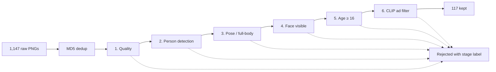

 # Person-Crop Dataset Curation Pipeline Project Report

> **How to read this document.** Section 3 ("Key design decisions") is the
> intellectual core. Section 5 ("Results") includes a discussion of *where the
> pipeline is weak and why*, which is more useful than the headline number.

## 1. Problem framing

The assignment provides a noisy directory of person crops and asks for a
system that filters it down to crops meeting four requirements:

1. **Full-body** — both head and lower body must be present.
2. **Face visible** — frontal or side view.
3. **No advertisements / mannequins** — only authentic photographs.
4. **No minors** — exclude crops of children below teenage years.

The pipeline must hit **> 90% coverage**, be computationally efficient, generalise
across datasets, and avoid heavy reliance on labelled data or vision-language
models such as GPT-4V or Gemini.

Each of the four requirements maps cleanly to a specific CV sub-problem:

| Requirement       | Sub-problem                                | Signal used                          |
| ----------------- | ------------------------------------------ | ------------------------------------ |
| Full-body         | Pose estimation / keypoint visibility      | YOLO11-pose keypoints                |
| Face visible      | Face detection                             | InsightFace (SCRFD via `buffalo_l`)  |
| Not an ad         | Zero-shot semantic classification          | CLIP image–text similarity           |
| No minors         | Age estimation                             | MiVOLOv2                             |

Two auxiliary problems sit upstream of those four: **basic image quality** (low
resolution, motion blur, completely black/white frames) and **person presence
at all** (some crops contain no person). These are cheap to check and very
effective at culling obvious noise before any expensive model runs.

## 2. System overview

The pipeline is a **six-stage early-exit cascade**. A crop either passes every
stage and ends up in `kept/`, or it is rejected by the first stage that fails
and downstream stages are skipped. The rejection stage is recorded so each
decision is fully interpretable.



| # | Stage              | Model                          | Rejects (1,001 in) | Pass rate |
| - | ------------------ | ------------------------------ | ------------------ | --------- |
| 1 | Quality            | OpenCV (heuristics)            | 217                | 78.3%     |
| 2 | Person detection   | YOLO11m (COCO class 0)         | 323                | 58.8%     |
| 3 | Pose / full-body   | YOLO11m-pose                   | 199                | 56.8%     |
| 4 | Face visible       | InsightFace `buffalo_l` (SCRFD)| 109                | 58.4%     |
| 5 | Age estimation     | MiVOLOv2 (`iitolstykh/mivolo_v2`)| 11               | 92.8%     |
| 6 | Advertisement      | CLIP ViT-B/32 (zero-shot)      | 25                 | 82.4%     |

Each stage is implemented as a subclass of `BaseFilter` in `src/components/`.
The base class handles timing, logging, and exception wrapping in its `apply()`
method; subclasses only implement `_apply(crop) -> StageResult`. This means
every stage has identical instrumentation "for free" and any one of them is
independently testable.

The orchestrator is `CurationPipeline` in `src/pipeline/curation_pipeline.py`.
It receives the list of filter instances from `scripts/run_pipeline.py` and
applies them in order to each crop.

## 3. Key design decisions

This is the section to read closely. Each subsection covers a non-obvious
choice, the alternative that was considered, and why it lost.

### 3.1 Early-exit cascade rather than parallel scoring

**Decision.** Run stages sequentially; on first rejection, skip the rest.

**Alternative considered.** Run all models on every crop and combine scores
into a single "keep / reject" decision.

**Why the cascade wins.** Three reasons.

First, **cost**. The cheap OpenCV quality check takes ~0.5 ms per crop and
removes 21.7% of inputs immediately. Running YOLO and CLIP on a 1×1 pixel
crop just to "score it more fairly" is wasted compute. On a 50-second
run, the cascade is doing roughly half the work a parallel-scoring pipeline
would.

Second, **interpretability**. Every rejection has a single attributable cause
(`rejected_at_stage`). The evaluation tooling uses this to produce a
per-violation breakdown (see Section 5) which would be much harder to construct
from a fused score.

Third, **debuggability**. When a particular crop is wrongly rejected, the run
log shows exactly which stage failed it and which metric tripped the threshold.
A real example from `run.log`:

```
Stage pose | crop_id: crop (366) | passed: False | 13.6 ms |
  head=0 < 1 | torso=1 < 2 | legs=1 < 2 | knees=0 < 2
```

### 3.2 Stage ordering: cheap → expensive, generic → specific

**Decision.** Quality → person detection → pose → face → age → ad filter.

The rationale is twofold and worth being explicit about:

- **Cost ordering.** Quality is OpenCV-only (~0.5 ms). Person detection and
  pose share a YOLO11m backbone (~12 ms each). Face is a small SCRFD model
  (~11 ms). Age is the most expensive at ~25 ms because MiVOLOv2 has to crop
  the body and face and run a transformer. CLIP is amortised across batches
  but still ~15 ms per crop.
- **Conceptual ordering.** Each stage assumes the previous stage's invariant
  holds. Pose verification only makes sense if a person was detected; age
  estimation needs a visible face; the ad filter only sees crops that have
  already passed all visual sanity checks, which lets us use generic
  "real-person-vs-mannequin" prompts without worrying about edge cases.

The cost of getting this order wrong is real: putting age or CLIP first would
roughly **double** the total runtime because they would run on the 88% of
crops that the earlier filters drop.

### 3.3 Keypoint visibility for "full-body", not bbox aspect ratio

**Decision.** Use YOLO11-pose and require visible keypoints from each of head,
shoulders, hips, and knees. The full criterion (see `config/thresholds.yaml`):

```yaml
pose:
  keypoint_confidence: 0.5   # per-keypoint visibility threshold
  min_head_kpts: 1            # at least 1 of {nose, eyes, ears}
  min_shoulder_kpts: 2        # both shoulders
  min_hip_kpts: 2             # both hips
  min_knee_kpts: 2            # both knees
```

**Alternative considered.** Use the person bbox aspect ratio as a proxy
("tall, narrow bbox → full-body").

**Why keypoints win.** Aspect ratio is a noisy proxy that breaks on common cases:

- A person sitting cross-legged is "full-body" but has a near-square bbox.
- A close-up mid-thigh portrait can have the right aspect ratio while clearly
  missing the lower half.
- A person leaning sideways has a wide bbox but is still full-body.

Keypoint visibility encodes the *actual definition* of full-body rather than
a proxy for it. The reason that matters for this assignment specifically is
the line in the brief: "*No feet or hands are acceptable*" — i.e. the
requirement is presence of specific body parts, not bbox geometry.

A note on the head check: the COCO keypoint set has five head keypoints (nose,
two eyes, two ears) and we only require **one** of them to be visible at
confidence ≥ 0.5. That tolerates side profiles and partial face occlusions
that the face-visibility stage handles separately and more precisely.

### 3.4 CLIP zero-shot for ad detection, not a trained classifier

**Decision.** Use CLIP ViT-B/32 with two prompt banks — "real person"
prompts and "advertisement / mannequin" prompts — and reject crops whose
ad-score exceeds their real-person score by a configurable margin.

**Alternative considered.** Train a binary CNN classifier on a hand-labelled
ad / non-ad subset.

**Why zero-shot wins for this assignment.** The brief explicitly asks to
*minimize the need for human labelling*. A trained classifier needs hundreds
to thousands of labelled examples to be robust; CLIP needs zero. Adjusting the
criterion (e.g. excluding studio-lit fashion shoots more aggressively) is an
edit to a YAML file rather than a re-labelling and re-training cycle. The
prompts that ship with this project (six "ad" prompts, five "real" prompts,
in `config/thresholds.yaml`) deliberately cover the failure modes most common
in the noisy dataset: in-store mannequins, studio fashion shoots, and retail
storefront product displays.

**Where it falls short.** This is the weakest stage by far — see Section 5.4.

### 3.5 Two YAML config files, validated by pydantic v2

**Decision.** Split configuration into `config.yaml` (paths, device, model
identifiers, runtime) and `thresholds.yaml` (every numerical knob). Both are
parsed into typed pydantic models at startup.

**Why split.** Paths and model identifiers change rarely. Thresholds change
constantly during tuning. Keeping them in separate files means threshold
sweeps don't risk accidentally clobbering path config, and `git diff` on a
threshold tuning experiment is purely numerical.

**Why pydantic.** Three concrete payoffs:

- **Fast failure.** A typo like `min_with` instead of `min_width` would
  otherwise silently fall back to a default value at runtime. With pydantic's
  `extra="forbid"`, the run dies at config-load with a precise error message
  before any 50-second pipeline run.
- **Type guarantees in code.** Downstream code reads `thresholds.quality.min_width`
  and gets an `int`, not an `Any` from a `dict.get()`. Static analysis catches
  spelling and type mistakes.
- **Reproducibility.** Each run writes its loaded `Thresholds` object out as
  `config_snapshot.json`. The combination of `thresholds.yaml` (source of truth)
  + `config_snapshot.json` (what was actually used) means any historical run is
  exactly reproducible from its own artifacts.

### 3.6 Deduplication before inference, not after

**Decision.** Hash every input file by MD5 of its bytes and keep only one
copy per hash group, *before* running the model cascade.

**Why this matters.** The provided dataset contains 1,147 files but only
**1,001 unique** crops — 146 redundant copies in 133 hash groups. Without
deduplication those copies waste ~5 seconds of GPU time per run and also bias
any per-class metric in favour of whichever classes happened to be duplicated.
The duplicate groups themselves are written out to `dedup_groups.json` so the
deduplication is auditable.

MD5 is appropriate here because we want **exact-match** dedup of file bytes.
Perceptual hashing (e.g. pHash) would also collapse visually-near-identical
crops, but for a curation pipeline that is *not* what we want — two genuinely
distinct photos of the same person should both be evaluated.

## 4. Evaluation methodology

### 4.1 Ground truth construction

A subset of **207 of the 1,001 unique crops** was hand-labelled. Each label
captures:

| Field              | Type                            | Notes                                                  |
| ------------------ | ------------------------------- | ------------------------------------------------------ |
| `crop_id`          | `str`                           | Filename stem, e.g. `crop (42)`                        |
| `should_keep`      | `bool`                          | True iff the crop meets all four requirements          |
| `violation_reason` | `ViolationReason` enum or null  | One of `blurry`, `no_person`, `not_full_body`, `face_hidden`, `minor`, `advertisement`; null when `should_keep` is True |
| `notes`            | `str`                           | Optional free-text for ambiguous cases                  |

Schema validation is enforced in `src/entities/validation_label.py` using a
pydantic `model_validator`: a label cannot be `should_keep=True` and also carry
a violation reason, and a rejected label *must* carry a reason.

### 4.2 Metrics

Two metrics are reported, with different jobs:

**Coverage** — of crops that *should* be rejected (any reason), what fraction
did the pipeline reject for *any* reason?

$$
\text{coverage} = \frac{\text{rejected labels}}{\text{all labels with should\_keep}=\text{False}}
$$

This is the metric the assignment grades against (the >90% target).

**Coverage at expected stage** — of labelled violations of reason *R*, what
fraction were rejected *at the stage R was supposed to catch*?

This second metric is what surfaces interesting structural issues that overall
coverage hides. A pipeline that rejects ad crops because they're *also* blurry
will look perfect by coverage but is fragile — change the dataset to non-blurry
ads and the system collapses. The discussion in Section 5.4 is built around
exactly this signal.

Standard classification metrics — accuracy, precision/recall/F1 for the "keep"
class, and a confusion matrix — are also reported for completeness.

## 5. Results

### 5.1 Overall


| Metric                   | Value      |
| ------------------------ | ---------- |
| Crops evaluated          | 207        |
| Accuracy                 | **92.75%** |
| Precision (keep)         | 71.43%     |
| Recall (keep)            | 62.50%     |
| F1 (keep)                | 66.67%     |
| **Coverage (rejects)**   | **96.72%** |

Coverage clears the assignment's 90% target with margin. The headline picture
is: **the system is conservative** — it rejects with high confidence (TN = 177
out of 183 actually-reject crops) but is willing to drop borderline good crops
(FN = 9 out of 24 actually-keep crops, which is what pulls recall down to
62.5%). For a *curation* problem with abundant raw input, that asymmetry is
the right trade-off: shipping a smaller-but-cleaner training set is preferable
to letting bad crops through.


### 5.2 Per-violation coverage


| Violation        | Labelled | Rejected | Coverage | Coverage at expected stage |
| ---------------- | -------: | -------: | -------: | -------------------------: |
| `blurry`         |       26 |       26 | 100.0%   |                      65.4% |
| `no_person`      |       28 |       28 | 100.0%   |                      82.1% |
| `not_full_body`  |       49 |       48 |  98.0%   |                      46.9% |
| `face_hidden`    |       32 |       29 |  90.6%   |                      53.1% |
| `advertisement`  |       40 |       40 | 100.0%   |                       2.5% |
| `minor`          |        8 |        6 |  75.0%   |                      62.5% |

Three observations are worth pulling out.

### 5.3 The cascade is doing the work, but not always at the "right" stage


The stacked bars above plot, for each labelled violation type, which stage
ended up rejecting the crop. The diagonal would be "every violation caught at
its dedicated stage" — and we are far from the diagonal in several places.

This is not a bug; it is a property of working with noisy real-world data,
where most "bad" crops fail multiple criteria simultaneously. A clothing-store
advertisement is typically *also* a partial-body crop *and* contains no
detectable person (because the mannequin has no skin tone). The earliest stage
that can reject such a crop will reject it, and the dedicated stage downstream
never gets to see it. The stacked-bar chart makes this concrete and is, in my
view, the most informative single plot in this report.

### 5.4 The ad filter is overshadowed but not redundant

The `advertisement` row in the table tells a striking story: 100% of labelled
ads are rejected by the pipeline, but **only 2.5%** of them are rejected at
the CLIP ad-filter stage. The other 97.5% are caught earlier — 42.5% by
`person_detection` (mannequins often fail to register as persons), 32.5% by
`pose` (studio shots are often mid-body crops), 12.5% by `quality`, and 10%
by `face`.

This raises a fair question: **is the CLIP stage worth keeping?** I argue yes,
for two reasons.

1. The 2.5% it does catch are the *hardest* ad crops — high-quality studio
   shoots that pass quality, contain a detectable real person in full-body
   pose, and have a visible face. Without the CLIP stage these would slip
   through.
2. The earlier-stage rejections are correlated with ad imagery in *this*
   dataset's specific failure modes (mannequins, partial body crops). On a
   cleaner-looking ad source (e.g. editorial fashion photography of real
   models) most of those earlier filters would pass and the CLIP stage would
   become the primary defence. Keeping it makes the pipeline more robust to
   distribution shift.

A stricter ablation — running each labelled ad through CLIP regardless of
earlier rejections — would tighten this claim and is listed in Section 6 as
future work.

### 5.5 Age estimation is the weak link

The `minor` row is the only one below the 90% target (75%). Two of the eight
labelled minors slip through. Three contributing factors:

- MiVOLOv2 is most accurate on front-facing, well-lit faces. Several of the
  labelled minors are in side profile, where the model regresses toward
  adult-typical age estimates.
- The chosen threshold (`min_age: 16`) is right at the boundary of teenage
  vs adult, where model uncertainty is highest. A more conservative threshold
  of 18 would catch more true minors but at the cost of false-rejecting young
  adults.
- The sample of eight is small. The 75% point estimate has very wide
  confidence intervals and shouldn't be over-interpreted.

I have intentionally not lowered the age threshold to make this number look
better — that would optimise for the validation set rather than for the real
goal of producing a clean training set.

### 5.6 Runtime

The end-to-end run processes 1,001 unique crops in **50 seconds** on a single
CUDA GPU (one consumer-grade card; specifics in `environment.json`). That is
roughly **20 crops/sec**, mixed across CPU-bound OpenCV checks, three YOLO/
SCRFD inferences, MiVOLOv2, and CLIP. The pipeline is currently sequential at
the per-crop level; batched inference (Section 6) is the obvious next
optimisation if throughput becomes a constraint.

## 6. Limitations and future work

Listed in roughly decreasing order of impact.

- **Single-annotator ground truth.** The 207 labels were authored by one
  annotator without inter-rater agreement. Borderline cases (mild blur, side
  profiles, teen-vs-adult) are the most likely to be inconsistent. For a
  production deployment, double-annotation with adjudication for disagreements
  would be the standard practice.
- **Per-crop, not batched inference.** YOLO, SCRFD, and CLIP all support
  batching, which would amortise GPU launch overhead and roughly 2–4× the
  throughput at the cost of slightly more complex bookkeeping in
  `CurationPipeline`.
- **Age estimation is the weakest stage.** Two paths to improve it: (a) gate
  age estimation behind a face-quality check (only run MiVOLO when the face
  is large, frontal, and unoccluded); (b) ensemble MiVOLOv2 with a second
  age model and reject the crop only when both agree the age is below
  threshold.
- **CLIP ad filter is under-evaluated.** Because most labelled ads are caught
  by earlier stages, the per-violation table understates how well CLIP itself
  would do on a harder ad distribution. A controlled ablation that disables
  earlier stages for the ad-labelled subset only, then re-runs CLIP, would
  give a true reading of the filter's strength.
- **Threshold generalisation is untested across datasets.** Every threshold
  in `thresholds.yaml` was tuned on this single noisy dataset. The
  per-keypoint visibility logic and CLIP prompt design were chosen to
  generalise rather than overfit, but this hasn't been verified on a second
  source.
- **No human-in-the-loop review of borderline cases.** Crops that score
  within a small margin of any threshold (e.g. `min_age` 16 ± 1 year,
  CLIP score within 0.02 of the decision boundary) would be valuable to
  surface for manual review. The current pipeline makes a hard decision on
  every crop.

## 7. Repository tour

For a reviewer who wants to read the code in a sensible order:

1. **`scripts/run_pipeline.py`** — the top-level entry point. Reads config,
   builds filters, runs the cascade, writes artifacts. The whole pipeline is
   visible from this one file.
2. **`src/pipeline/curation_pipeline.py`** — the orchestrator. Tight loop
   that applies each filter and stops on first failure.
3. **`src/components/base.py`** — the `BaseFilter` abstract base class.
   Reading this explains the shared timing/logging/exception contract every
   stage obeys.
4. **`src/components/*.py`** — one file per stage. Each file is < 200 LOC
   and reads independently.
5. **`src/settings/config.py`** — the pydantic config schemas. The single
   source of truth for what thresholds exist and what types they have.
6. **`src/pipeline/evaluation_pipeline.py`** — the evaluator. Loads
   `decisions.parquet` and a labels CSV, computes overall and per-violation
   metrics, returns an `EvaluationResult` dataclass that knows how to
   serialise itself.
7. **`scripts/evaluate.py`** — thin CLI wrapper around the evaluator.

A typical run produces, in `artifacts/runs/<run-id>/`:

```
manifest.json            slim summary: counts, timing, stage stats
config_snapshot.json     the exact Thresholds used for this run
environment.json         python / torch / library versions, data dir
dedup_groups.json        every hash group with >1 file
decisions.parquet        one row per crop, with stage-by-stage metrics
evaluation.json          (after evaluate.py) overall + per-violation
run.log                  archived copy of the per-run loguru log
kept/                    copies of every kept crop
samples/rejected_at_X/   20 random rejects per stage for visual spot-check
```

The `samples/rejected_at_X/` folders were the single most useful debugging
artifact during development — they make it possible to look at thirty crops
that the pose stage rejected and immediately spot whether a threshold is
too loose or too strict, without writing any code.

---

**Submission run.** All numbers in this report come from run
`2026-05-12_204240`, produced with the configuration in
`config/config.yaml` and `config/thresholds.yaml` checked into this repo.
The full manifest, decisions, plots, and archived log file are available in
`artifacts/runs/2026-05-12_204240/`.