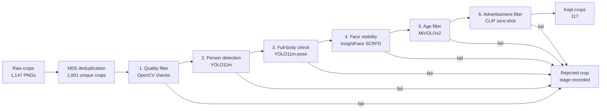

# Person-Crop Dataset Curation Pipeline Report

## 1. Problem Statement and Primary Metric

Modern AI applications such as surveillance analytics, autonomous systems, and
person re-identification rely on high-quality person datasets. In practice,
large image collections are often noisy: some crops are blurry, some do not
contain a person, some show only part of the body, and some come from
advertisements or mannequins. Manually reviewing these images is slow,
expensive, and difficult to scale.

This project builds an automated computer vision curation pipeline that keeps
usable full-body person crops while minimizing manual review. A crop should be
kept only when it satisfies these requirements:

- full-body person crops where the face is visible from the front or side,
- real people rather than advertisements or mannequins,
- teenagers or adults, not young children.

The primary success metric is **coverage**, also called **recall on the reject
class**. In simple terms, coverage answers:

> Of the images that should be removed, how many did the pipeline successfully
> remove?

For example, imagine a validation set with 100 bad images. If the pipeline
rejects 95 of them and accidentally lets 5 bad images through, coverage is:

```text
coverage = bad images correctly rejected / all bad images
         = 95 / 100
         = 95%
```

This metric matters more than plain accuracy for dataset curation because the
main risk is allowing bad images into the final training dataset. Losing some
valid images is not ideal, but keeping invalid crops is worse because it pollutes
the dataset.

In the final evaluation, there were 183 validation crops that should be
rejected. The pipeline correctly rejected 177 of them:

```text
coverage = 177 / (177 + 6) = 96.72%
```

This clears the 90% target and shows that the pipeline is effective at removing
invalid images.

## 2. Pipeline Overview

The system is a six-stage early-exit cascade. Each image is checked stage by
stage. If a stage rejects the image, later stages are skipped and the rejection
reason is recorded.

| Step | Stage | Purpose | Method |
| ---: | --- | --- | --- |
| 0 | Deduplication | Remove exact duplicate files before inference | MD5 hash |
| 1 | Quality | Remove very small, dark, blank, or blurry crops | OpenCV heuristics |
| 2 | Person detection | Confirm a person is present | YOLO11m |
| 3 | Full-body check | Confirm head, torso, hips, and knees are visible | YOLO11m-pose |
| 4 | Face visibility | Confirm a detectable visible face | InsightFace SCRFD |
| 5 | Age filter | Exclude likely young children | MiVOLOv2 |
| 6 | Ad filter | Exclude ads, mannequins, and product-style images | CLIP zero-shot prompts |

This design is efficient because cheap filters run first, followed by pretrained
deep learning models. Expensive stages only run on image crops that survive
earlier checks.



The final evaluation run processed 1,001 unique crops and kept 117 crops.

## 3. Key Design Decisions

**Sequential cascade instead of parallel components.** The pipeline does not
run every model on every crop. It runs stages sequentially and stops as soon as
one stage rejects the image. This is faster and easier to debug. A black or tiny
crop does not need YOLO, SCRFD, MiVOLO, or CLIP inference. A crop with no person
does not need pose or age estimation. Sequential execution also gives one clear
rejection reason, such as `quality`, `pose`, or `face`, instead of a confusing
set of competing model scores.

**YOLO11m for person detection.** The person detection stage only answers one
question: "Is there a real person occupying enough of this crop?" YOLO11m is a
good fit because it is a modern, fast, pretrained object detector with a COCO
`person` class already available. Popular alternatives such as Faster R-CNN,
DETR-style detectors, or larger YOLO variants can also detect people, but they
are heavier for this use case. Smaller detectors would be faster, but may miss
harder crops. YOLO11m gives a practical middle ground: strong person detection,
simple deployment through Ultralytics, GPU support, and enough speed for a
curation pipeline.

**Separate YOLO11m and YOLO11m-pose stages.** It is true that YOLO11m-pose also
detects people, so the pipeline could have skipped the separate detection model
and used pose for both detection and keypoints. I kept them separate because
they serve different jobs. The detector is a cheaper gate that removes crops
with no person or tiny person boxes before the pose model runs. The pose model
is then reserved for crops where pose information is actually needed. This makes
the decision logic clearer: detection decides "person present", while pose
decides "full body visible". It adds some code, but it improves interpretability
and keeps each stage responsible for one requirement.

**YOLO11m-pose for full-body verification.** The full-body requirement is not
well captured by bounding-box aspect ratio. A tall crop can still miss knees,
and a sitting or leaning person can have an unusual box shape. YOLO11m-pose
stands out because it gives COCO body keypoints, letting the pipeline directly
check whether the head, shoulders, hips, and knees are visible. Generic object
detectors can say "person", but they cannot reliably say "full body is visible"
without keypoints.

**SCRFD through InsightFace for face visibility.** Face visibility is a
specialized task, so the pipeline uses a specialized face detector rather than
asking YOLO to detect faces. SCRFD is lightweight, fast, and robust on small or
side-facing faces, which are common in person crops. Through InsightFace, it
also returns detection confidence and facial landmarks. The pipeline uses those
signals to reject crops with no face, a very tiny face, or unreliable landmarks.
This is better for this task than a generic face classifier because the pipeline
needs a precise visible-face check inside the detected person crop.

**MiVOLOv2 for age filtering.** Age is not something the detector, pose model,
or face detector can infer. MiVOLOv2 is used because it is designed for visual
age estimation and can use both face and body crops. That matters here because
some faces are small, side-facing, or partially low quality. The pipeline first
waits until person and face boxes are available, then gives MiVOLOv2 the face
and body regions and rejects crops with predicted age below 16. This stage is
the weakest part of the system, but it is still more suitable than simple face
size rules or a generic image classifier.

**CLIP for advertisement and mannequin filtering.** Advertisement detection is
semantic: the image may contain a person-like subject, but still be a mannequin,
retail display, or fashion advertisement. Training a custom ad classifier would
require many labeled examples. CLIP stands out because it supports zero-shot
image-text matching. The pipeline compares each crop against "real person"
prompts and "advertisement / mannequin" prompts, then rejects crops where the ad
prompts score higher. This keeps the system flexible and minimizes manual
labeling.

**No VLMs.** The pipeline uses conventional CV models and pretrained
vision-only or image-text models: YOLO, SCRFD, MiVOLOv2, OpenCV checks, and
CLIP. It does not use GPT-4V, Gemini, InternVL, Qwen-VL, or similar
Vision-Language Models.

**Typed configuration.** Paths, model names, and thresholds are stored in YAML
and validated with pydantic. This keeps tuning explicit and makes each run
reproducible through saved config snapshots.

## 4. Evaluation Setup

The final evaluation uses run `2026-05-12_204240`.

| Item | Value |
| --- | ---: |
| Unique pipeline decisions | 1,001 |
| Labeled validation crops | 207 |
| Labels without decisions | 0 |
| Kept crops in full run | 117 |

## 5. Results


| Metric | Value |
| --- | ---: |
| Accuracy | 92.75% |
| Precision keep | 71.43% |
| Recall keep | 62.50% |
| F1 keep | 66.67% |
| **Coverage / reject recall** | **96.72%** |

The pipeline clears the 90% coverage target. It is intentionally
conservative: it rejects most bad crops, but also loses some valid crops. For a
curation task, this is a reasonable trade-off because a smaller clean dataset is
usually preferable to a larger noisy one.


| Count | Value |
| --- | ---: |
| True positives: correctly kept | 15 |
| False negatives: good crop lost | 9 |
| True negatives: correctly rejected | 177 |
| False positives: bad crop leaked | 6 |

## 6. Coverage by Requirement Violation


| Violation type | Labeled | Rejected | Coverage |
| --- | ---: | ---: | ---: |
| blurry | 26 | 26 | 100.00% |
| advertisement | 40 | 40 | 100.00% |
| no_person | 28 | 28 | 100.00% |
| not_full_body | 49 | 48 | 97.96% |
| face_hidden | 32 | 29 | 90.62% |
| minor | 8 | 6 | 75.00% |

Most violation types meet or exceed 90% coverage. The weakest category is
`minor`, with 6 of 8 labeled examples rejected. This is the main remaining
model-risk area because age estimation is difficult for side profiles,
low-resolution faces, and borderline teenager/adult cases.

## 7. Limitations and Future Work

- **Age filtering needs improvement.** Add a face-quality gate before age
  inference, or ensemble MiVOLOv2 with a second age model for borderline cases.
- **Validation labels are limited.** The 207 labels were enough to validate the
  main target, but the minor class only has 8 examples.
- **Inference is mostly per-crop.** Batching YOLO, SCRFD, age, and CLIP stages
  would improve throughput.
- **Ad filtering could be evaluated more directly.** Many ads are rejected
  before the CLIP stage, so a CLIP-only ablation on ad-labeled crops would give
  a cleaner measure of that stage.

## 8. Reproducibility

To reproduce the final run and evaluation:

```bash
python scripts/run_pipeline.py
python scripts/evaluate.py --run-folder artifacts/runs/2026-05-12_204240
```

Important artifacts:

- `artifacts/runs/2026-05-12_204240/decisions.parquet`
- `artifacts/runs/2026-05-12_204240/evaluation.json`
- `notebooks/07_final_evaluation.ipynb`
- `config/config.yaml`
- `config/thresholds.yaml`
