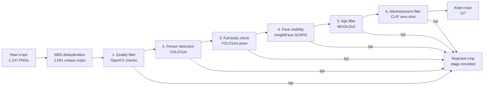
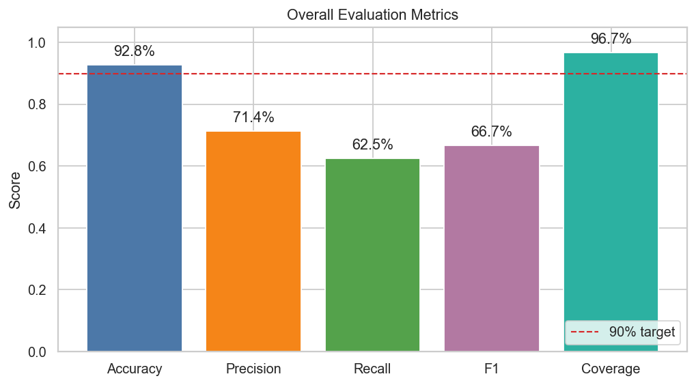
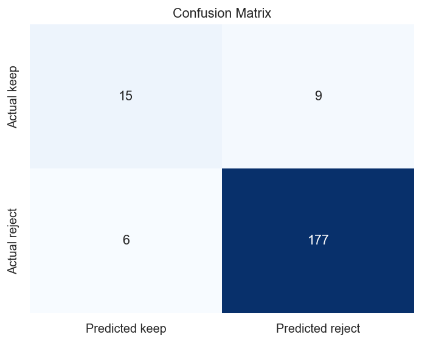
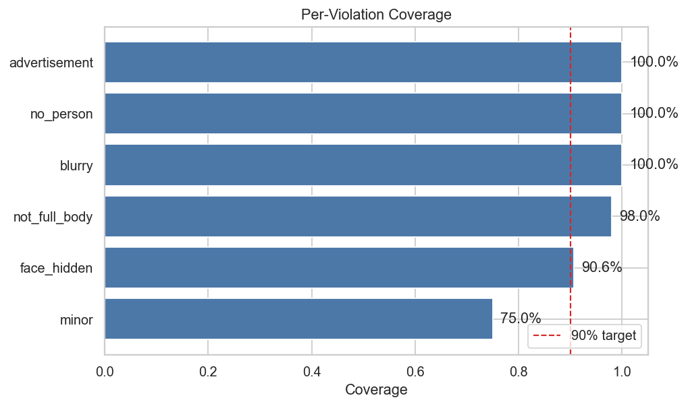

# Person-Crop Dataset Curation Pipeline Report

## 1. Problem Statement and Primary Metric

Modern AI applications such as surveillance analytics, autonomous systems, and
person re-identification rely on high-quality person datasets. In practice,
large image collections are often noisy: some crops are blurry, some do not
contain a person, some show only part of the body, and some come from
advertisements or mannequins. Manually reviewing these images is slow,
expensive, and difficult to scale.

This project builds an automated computer vision curation pipeline that keeps
usable full-body person crops while minimizing manual review. A crop should be
kept only when it satisfies these requirements:

- full-body person crops where the face is visible from the front or side,
- real people rather than advertisements or mannequins,
- teenagers or adults, not young children.

The primary success metric is **coverage**, also called **recall on the reject
class**. In simple terms, coverage answers:

> Of the images that should be removed, how many did the pipeline successfully
> remove?

For example, imagine a validation set with 100 bad images. If the pipeline
rejects 95 of them and accidentally lets 5 bad images through, coverage is:

```text
coverage = bad images correctly rejected / all bad images
         = 95 / 100
         = 95%
```

This metric matters more than plain accuracy for dataset curation because the
main risk is allowing bad images into the final training dataset. Losing some
valid images is not ideal, but keeping invalid crops is worse because it pollutes
the dataset.

In the final evaluation, there were 183 validation crops that should be
rejected. The pipeline correctly rejected 177 of them:

```text
coverage = 177 / (177 + 6) = 96.72%
```

This clears the 90% target and shows that the pipeline is effective at removing
invalid images.

## 2. Pipeline Overview

The system is a six-stage early-exit cascade. Each image is checked stage by
stage. If a stage rejects the image, later stages are skipped and the rejection
reason is recorded.

| Step | Stage | Purpose | Method |
| ---: | --- | --- | --- |
| 0 | Deduplication | Remove exact duplicate files before inference | MD5 hash |
| 1 | Quality | Remove very small, dark, blank, or blurry crops | OpenCV heuristics |
| 2 | Person detection | Confirm a person is present | YOLO11m |
| 3 | Full-body check | Confirm head, torso, hips, and knees are visible | YOLO11m-pose |
| 4 | Face visibility | Confirm a detectable visible face | InsightFace SCRFD |
| 5 | Age filter | Exclude likely young children | MiVOLOv2 |
| 6 | Ad filter | Exclude ads, mannequins, and product-style images | CLIP zero-shot prompts |

This design is efficient because cheap filters run first, followed by pretrained
deep learning models. Expensive stages only run on image crops that survive
earlier checks.



The final evaluation run processed 1,001 unique crops and kept 117 crops.

## 3. Key Design Decisions

| Decision | Why it was chosen |
| --- | --- |
| Run stages sequentially, not in parallel | Most bad crops can be rejected early. A dark image does not need pose, age, or CLIP inference. This saves compute and gives one clear rejection reason. |
| Use a cascade instead of one combined score | Each stage maps to one requirement: quality, person, full body, face, age, and advertisement. This makes failures easier to inspect and tune. |
| Keep thresholds in YAML | Thresholds can be adjusted without changing code, and each run can be reproduced from saved configs. |
| Avoid VLMs | The pipeline uses conventional CV models and CLIP, but not GPT-4V, Gemini, InternVL, Qwen-VL, or similar VLMs. |

| Model / method | Used for | How it filters | Why this choice |
| --- | --- | --- | --- |
| OpenCV heuristics | Basic quality | Rejects tiny, very dark/bright, blurry, or badly shaped crops. | Fast, simple, and enough for obvious quality problems. No deep model is needed here. |
| YOLO11m | Person detection | Rejects crops with no confident person, a tiny person box, or too many people. | Good speed/accuracy balance. Lighter than many two-stage detectors and easier to deploy than heavier detector families. |
| YOLO11m-pose | Full-body check | Checks whether head, shoulders, hips, and knees are visible. | Keypoints directly match the full-body requirement. A normal detector can find a person, but cannot reliably prove the full body is visible. |
| Two YOLO stages | Person first, pose second | YOLO11m first removes no-person/tiny-person crops. YOLO11m-pose only runs when keypoints are needed. | This is clearer than using pose for everything: detection answers "is there a person?", pose answers "is the full body visible?" |
| SCRFD via InsightFace | Face visibility | Rejects crops with no face, tiny face, low-confidence face, or unreliable landmarks. | Built specifically for face detection, including small and side-facing faces. More suitable than a generic object detector for this step. |
| MiVOLOv2 | Age filtering | Uses face and body crops, then rejects predicted ages below 16. | Age needs a specialized model. MiVOLOv2 can use both face and body context, which helps when the face is small or side-facing. |
| CLIP | Advertisement/mannequin filtering | Compares the crop against real-person prompts and ad/mannequin prompts. Rejects when ad prompts score higher. | Allows zero-shot semantic filtering without training a custom ad classifier or labeling many ad examples. |

## 4. Evaluation Setup

The final evaluation uses run `2026-05-12_204240`.

| Item | Value |
| --- | ---: |
| Unique pipeline decisions | 1,001 |
| Labeled validation crops | 207 |
| Labels without decisions | 0 |
| Kept crops in full run | 117 |

## 5. Results



| Metric | Value |
| --- | ---: |
| Accuracy | 92.75% |
| Precision keep | 71.43% |
| Recall keep | 62.50% |
| F1 keep | 66.67% |
| **Coverage / reject recall** | **96.72%** |

The pipeline clears the 90% coverage target. It is intentionally
conservative: it rejects most bad crops, but also loses some valid crops. For a
curation task, this is a reasonable trade-off because a smaller clean dataset is
usually preferable to a larger noisy one.



| Count | Value |
| --- | ---: |
| True positives: correctly kept | 15 |
| False negatives: good crop lost | 9 |
| True negatives: correctly rejected | 177 |
| False positives: bad crop leaked | 6 |

## 6. Coverage by Requirement Violation



| Violation type | Labeled | Rejected | Coverage |
| --- | ---: | ---: | ---: |
| blurry | 26 | 26 | 100.00% |
| advertisement | 40 | 40 | 100.00% |
| no_person | 28 | 28 | 100.00% |
| not_full_body | 49 | 48 | 97.96% |
| face_hidden | 32 | 29 | 90.62% |
| minor | 8 | 6 | 75.00% |

Most violation types meet or exceed 90% coverage. The weakest category is
`minor`, with 6 of 8 labeled examples rejected. This is the main remaining
model-risk area because age estimation is difficult for side profiles,
low-resolution faces, and borderline teenager/adult cases.

## 7. Limitations and Future Work

- **Age filtering needs improvement.** Add a face-quality gate before age
  inference, or ensemble MiVOLOv2 with a second age model for borderline cases.
- **Validation labels are limited.** The 207 labels were enough to validate the
  main target, but the minor class only has 8 examples.
- **Inference is mostly per-crop.** Batching YOLO, SCRFD, age, and CLIP stages
  would improve throughput.
- **Ad filtering could be evaluated more directly.** Many ads are rejected
  before the CLIP stage, so a CLIP-only ablation on ad-labeled crops would give
  a cleaner measure of that stage.

## 8. Reproducibility

To reproduce the final run and evaluation:

```bash
python scripts/run_pipeline.py
python scripts/evaluate.py --run-folder artifacts/runs/2026-05-12_204240
```

Important artifacts:

- `artifacts/runs/2026-05-12_204240/decisions.parquet`
- `artifacts/runs/2026-05-12_204240/evaluation.json`
- `notebooks/07_final_evaluation.ipynb`
- `config/config.yaml`
- `config/thresholds.yaml`
