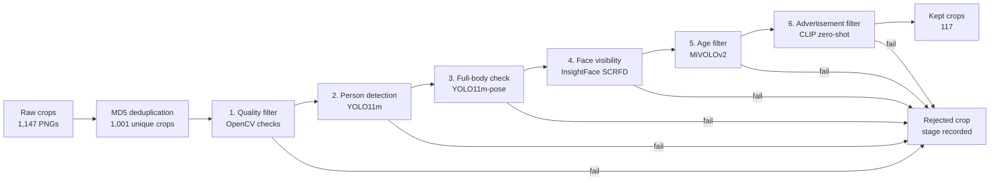

# Person-Crop Dataset Curation Pipeline Report

## 1. Introduction

Modern computer vision systems need clean person datasets. In practice, raw
image collections are noisy: some crops are blurry, some do not contain a
person, some show only part of the body, and some come from advertisements,
mannequins, or product displays. Manually reviewing every crop is slow,
expensive, and difficult to scale.

This project builds an automated dataset curation pipeline for person crops. The
pipeline keeps images only when they satisfy the target dataset requirements:

- the crop contains a full-body person,
- the face is visible from the front or side,
- the crop shows a real person rather than an advertisement or mannequin,
- the person is a teenager or adult, not a young child.

The main result is that the final pipeline reaches **96.72% coverage**, clearing
the 90% target. In practical terms, the system catches most invalid crops before
they enter the final dataset.

## 2. Problem Definition and Algorithm

### 2.1 Task Definition

**Input.** A directory of noisy person-crop images.

**Output.** Two groups of images:

- `kept`: crops that satisfy all dataset requirements,
- `rejected`: crops removed by the first failed pipeline stage.

Each crop also receives a structured decision record containing whether it was
kept, where it was rejected, stage-level metrics, and timing information.

The primary evaluation metric is **coverage**, also called **recall on the
reject class**. Coverage answers one simple question:

> Of the images that should be removed, how many did the pipeline successfully
> remove?

For example, suppose a validation set contains 100 bad images. If the pipeline
rejects 95 and accidentally lets 5 through, coverage is:

```text
coverage = bad images correctly rejected / all bad images
         = 95 / 100
         = 95%
```

This metric is more important than plain accuracy for this project because the
main risk is letting invalid images into the curated training dataset.

### 2.2 Algorithm Definition

The algorithm is an early-exit cascade. Each image moves through the stages in
order. If one stage fails, the image is rejected immediately and later stages do
not run.



| Step | Stage | Purpose | Method |
| ---: | --- | --- | --- |
| 0 | Deduplication | Remove exact duplicate files before inference | MD5 hash |
| 1 | Quality | Remove tiny, dark, overexposed, blurry, or badly shaped crops | OpenCV heuristics |
| 2 | Person detection | Confirm a person is present and large enough | YOLO11m |
| 3 | Full-body check | Confirm head, shoulders, hips, and knees are visible | YOLO11m-pose |
| 4 | Face visibility | Confirm a visible face inside the person crop | InsightFace SCRFD |
| 5 | Age filter | Exclude likely young children | MiVOLOv2 |
| 6 | Ad filter | Exclude ads, mannequins, and product-style images | CLIP prompts |

The stages are sequential rather than parallel. This keeps the pipeline fast:
an obviously bad crop does not need every model. It also makes each decision
easy to explain because every rejected crop has one `rejected_at_stage` value.

| Decision | Reasoning |
| --- | --- |
| Run stages sequentially | Most invalid crops can be rejected early. Running every model in parallel would waste compute on images that already failed simple checks. |
| Use a cascade | Each stage maps to one requirement: quality, person, full body, face, age, or advertisement. This keeps the system easy to debug. |
| Keep thresholds in YAML | Thresholds can be adjusted without changing code, and runs remain reproducible. |
| Avoid VLMs | The system uses conventional CV models and CLIP, but not GPT-4V, Gemini, InternVL, Qwen-VL, or similar VLMs. |

| Model / method | Used for | Why it fits this stage | How it runs in the pipeline |
| --- | --- | --- | --- |
| OpenCV heuristics | Basic quality | Quality failures such as very small size, extreme brightness, and blur are simple image statistics. A deep model would be unnecessary here. | Runs first on every crop and removes obvious bad inputs before GPU inference. |
| YOLO11m | Person detection | It is a fast, practical pretrained person detector with a good speed/accuracy trade-off. Heavier detectors can also work, but are less attractive for a scalable curation pass. | Runs after quality. Rejects crops with no confident person, a tiny person box, or too many people. |
| YOLO11m-pose | Full-body check | A normal detector can say "person", but not whether the full body is visible. Pose keypoints directly test head, shoulders, hips, and knees. | Runs only after a person is detected. Rejects crops missing required body keypoints. |
| SCRFD via InsightFace | Face visibility | Face detection is specialized. SCRFD is lightweight and works well for small or side-facing faces, which generic object detectors may miss. | Runs after pose. Looks for a reliable face inside the detected person crop. |
| MiVOLOv2 | Age filtering | Age needs a specialized model. MiVOLOv2 uses both face and body context, which helps when the face is small or angled. | Runs after person and face boxes are available. Rejects predicted ages below 16. |
| CLIP | Ad/mannequin filtering | Advertisements and mannequins are semantic categories. CLIP supports zero-shot image-text matching, avoiding a custom labeled ad dataset. | Runs near the end on crops that otherwise look valid. Rejects crops closer to ad/mannequin prompts than real-person prompts. |

**Why two YOLO models instead of only YOLO11m-pose?** YOLO11m-pose can detect
people, so using it for both detection and pose would reduce code. I kept the
stages separate because they answer different questions. YOLO11m is a direct
"is there a person?" gate and removes no-person or tiny-person crops before the
pose model is needed. YOLO11m-pose then focuses only on the harder question:
"is enough of the body visible?" This makes the pipeline easier to inspect,
because detection failures and full-body failures are not mixed into one stage.

**Concrete example.** A dark crop is rejected at the quality stage and never
reaches the GPU models. A crop with no person is rejected by YOLO11m and never
reaches pose or age estimation. A high-quality full-body crop with a visible
face reaches MiVOLOv2 and CLIP, because only then are age and ad/mannequin
checks meaningful.

## 3. Experimental Evaluation

### 3.1 Methodology

The final evaluation uses run `2026-05-12_204240`.

| Item | Value |
| --- | ---: |
| Unique pipeline decisions | 1,001 |
| Labeled validation crops | 207 |
| Labels without decisions | 0 |
| Kept crops in full run | 117 |

The 207 labeled validation crops were compared against the pipeline decisions.
For this project, coverage is computed as:

```text
coverage = correctly rejected bad crops / all labeled bad crops
         = 177 / (177 + 6)
         = 96.72%
```

The validation set contains 183 crops that should be rejected and 24 crops that
should be kept. The most important error is a bad crop leaking into the final
dataset.

Brief metric meanings:

| Metric | Meaning in this project |
| --- | --- |
| Accuracy | Overall fraction of labeled crops classified correctly. |
| Precision keep | Of crops the pipeline kept, how many were actually valid. |
| Recall keep | Of valid crops, how many the pipeline successfully kept. |
| F1 keep | Balance between keep precision and keep recall. |
| Coverage / reject recall | Of invalid crops, how many the pipeline successfully rejected. This is the primary metric. |
| False positive | A bad crop that leaked into the kept set. |
| False negative | A good crop that was rejected. |

### 3.2 Results


| Metric | Value |
| --- | ---: |
| Accuracy | 92.75% |
| Precision keep | 71.43% |
| Recall keep | 62.50% |
| F1 keep | 66.67% |
| **Coverage / reject recall** | **96.72%** |


| Count | Value |
| --- | ---: |
| True positives: correctly kept | 15 |
| False negatives: good crop lost | 9 |
| True negatives: correctly rejected | 177 |
| False positives: bad crop leaked | 6 |


| Violation type | Labeled | Rejected | Coverage |
| --- | ---: | ---: | ---: |
| blurry | 26 | 26 | 100.00% |
| advertisement | 40 | 40 | 100.00% |
| no_person | 28 | 28 | 100.00% |
| not_full_body | 49 | 48 | 97.96% |
| face_hidden | 32 | 29 | 90.62% |
| minor | 8 | 6 | 75.00% |

### 3.3 Discussion

The results support the main hypothesis: a staged computer vision cascade can
remove most invalid person crops without using VLMs or training a new model.
The pipeline is intentionally conservative. It rejects most bad crops, but it
also loses some valid crops. For dataset curation, this is acceptable because a
smaller clean dataset is usually more useful than a larger noisy one.

The strongest categories are blurry, advertisement, no-person, and not-full-body
crops. The weakest category is `minor`, with 6 of 8 labeled minor examples
rejected. This is expected because age estimation is harder for side profiles,
small faces, and borderline teenager/adult cases.

## 4. Related Work

This project combines pretrained models rather than proposing a new model.

| Area | Related approach | How this project uses it |
| --- | --- | --- |
| Object detection | YOLO-style one-stage detectors | Used for fast person detection. |
| Pose estimation | Keypoint-based human pose models | Used to check whether the full body is visible. |
| Face detection | SCRFD / InsightFace | Used for specialized visible-face filtering. |
| Age estimation | MiVOLOv2 | Used for child filtering with face and body context. |
| Zero-shot image-text matching | CLIP | Used for ad/mannequin filtering without custom training labels. |

The main difference from a single-model solution is that this project uses
specialized pretrained models for specialized checks. That makes the system
easier to debug and easier to tune for dataset curation.

## 5. Future Work

- Improve age filtering with a face-quality gate or a second age model.
- Batch YOLO, SCRFD, MiVOLOv2, and CLIP inference to increase throughput.
- Evaluate the CLIP ad filter directly on a harder ad/mannequin subset.
- Add a human review queue for borderline crops near stage thresholds.
- Validate the thresholds on a second dataset to test generalization.

## 6. Conclusion

The pipeline provides a practical automated curation system for noisy
person-crop datasets. It processes 1,001 unique crops, keeps 117, and reaches
**96.72% coverage** on the labeled validation set. The main design strength is
the sequential cascade: simple checks remove obvious failures early, while
specialized pretrained models handle person detection, pose, face visibility,
age, and advertisement filtering.

## Bibliography

[1] Ultralytics. YOLO11 model documentation.

[2] Jia Guo, Jiankang Deng, Alexandros Lattas, and Stefanos Zafeiriou. "Sample
and Computation Redistribution for Efficient Face Detection." arXiv:2105.04714.

[3] Maksim Kuprashevich and Irina Tolstykh. "MiVOLO: Multi-input Transformer for
Age and Gender Estimation." arXiv:2307.04616.

[4] Alec Radford et al. "Learning Transferable Visual Models From Natural
Language Supervision." ICML 2021.

[5] Raymond J. Mooney. "Project Report Format." CS 391L Machine Learning,
University of Texas at Austin.

## Reproducibility

To reproduce the final run and evaluation:

```bash
python scripts/run_pipeline.py
python scripts/evaluate.py --run-folder artifacts/runs/2026-05-12_204240
```

Important artifacts:

- `artifacts/runs/2026-05-12_204240/decisions.parquet`
- `artifacts/runs/2026-05-12_204240/evaluation.json`
- `notebooks/07_final_evaluation.ipynb`
- `config/config.yaml`
- `config/thresholds.yaml`
