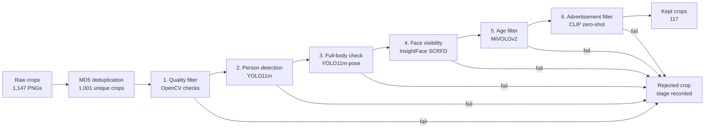

# Person-Crop Dataset Curation Pipeline

## 1. Introduction

Computer vision systems that work with images of people depend on the quality
of their training data. In practice, raw image collections are noisy: a
non-trivial fraction of crops are blurry, contain no person at all, show only
part of the body, or come from advertisements, mannequins, and product
displays. Reviewing each crop by hand is slow, expensive, and inconsistent
between annotators, and does not scale to the dataset sizes that modern
training pipelines require.

This project builds an automated curation pipeline for person crops. The
pipeline keeps an image only when it satisfies all four target requirements:

- the crop contains a **full-body** person,
- the **face is visible** from the front or in profile,
- the crop shows a **real person** rather than an advertisement or mannequin,
- the person is a **teenager or adult**, not a young child.

The final pipeline reaches **96.72% coverage** on a hand-labelled validation
set of 207 crops, clearing the 90% target with margin. In practical terms,
the system catches roughly 97 out of every 100 invalid crops before they
enter the curated dataset, and does so in approximately 50 seconds on a
single consumer GPU.

The remainder of this report defines the task and algorithm (Section 2),
presents the evaluation methodology and results (Section 3), positions the
work against related approaches (Section 4), discusses limitations and
proposed next steps (Section 5), and concludes (Section 6).

## 2. Problem Definition and Algorithm

### 2.1 Task Definition

**Input.** A directory of noisy person-crop images.

**Output.** Two groups of images and a structured decision record per crop:

- `kept` — crops satisfying all four requirements,
- `rejected` — crops removed by the first stage that failed.

Each decision record contains the crop identifier, the final keep/reject
verdict, the stage that produced a rejection (if any), the numeric metrics
computed at every stage the crop visited, and per-stage timing. These records
are written to a Parquet file so the full run is auditable after the fact.

The primary evaluation metric is **coverage**, also referred to as the recall
on the reject class. Coverage answers a single question:

> Of the images that should be removed, what fraction did the pipeline
> successfully remove?

For a worked example, suppose a validation set contains 100 invalid images.
If the pipeline rejects 95 of them and lets 5 through, coverage is:

```text
coverage = invalid crops correctly rejected / all invalid crops
         = 95 / 100
         = 95%
```

Coverage is preferred over plain accuracy for this project because the two
error types differ sharply in cost. Letting an invalid crop reach the curated
dataset can degrade any downstream model trained on it, while accidentally
rejecting a valid crop is cheap to recover from when raw input is plentiful.
Coverage measures the costly error class directly.

### 2.2 Algorithm Definition

The algorithm is a **six-stage early-exit cascade**. Each image moves through
the stages in order, and the first stage to fail produces an immediate
rejection — the remaining stages do not run for that crop. A short
deduplication step at the front removes exact-duplicate files before any
inference begins.



| # | Stage              | Model                  | Rejects crops that…                                              |
| - | ------------------ | ---------------------- | ---------------------------------------------------------------- |
| 1 | Quality            | OpenCV heuristics      | are too small, too dark, overexposed, blurry, or mis-shaped      |
| 2 | Person detection   | YOLO11m                | contain no confident person, a tiny person, or a crowded scene   |
| 3 | Full-body check    | YOLO11m-pose           | are missing head, shoulder, hip, or knee keypoints               |
| 4 | Face visibility    | InsightFace SCRFD      | have no reliable face inside the person box                      |
| 5 | Age filter         | MiVOLOv2               | are predicted to depict a minor (age < 16)                       |
| 6 | Advertisement      | CLIP (ViT-B/32)        | match advertisement / mannequin prompts more than real-person prompts |

#### Design principles

Three principles drive every choice in this section.

**Cheap before expensive.** The cheapest checks come first. Quality is pure
OpenCV and runs in well under a millisecond per crop, removing 21.7% of
inputs (217 of 1,001) before any GPU model is loaded. The expensive
deep-learning models then run only on the survivors.

**One stage, one question.** Each stage maps to exactly one of the four
target requirements (plus the two upstream sanity checks). This is why every
rejected crop has a single `rejected_at_stage` value, and it is what makes
the per-violation analysis in Section 3 possible. A fused single-score
classifier would offer no equivalent breakdown.

**Specialised models for specialised checks.** Face detection, age
estimation, and advertisement classification each have a model already
trained on the right distribution. Using them directly is cheaper, more
accurate, and more interpretable than fine-tuning a single multi-task model
on a small custom dataset.

#### Stage details

**1. Quality (OpenCV heuristics).** Six simple image statistics: minimum
width and height, minimum aspect ratio (a standing person is taller than
wide), a brightness band that excludes near-black and near-white frames,
and a Laplacian-variance sharpness measure for motion blur. A deep model
would add latency without adding signal at this stage.

**2. Person detection (YOLO11m).** A fast, well-tested general object
detector with a favourable speed/accuracy trade-off for curation passes.
Rejects crops with no person at confidence ≥ 0.5, a person box covering
less than 40% of the crop, or more than five overlapping detections (a
sign of a crowded scene rather than a clean single-person crop).

**3. Full-body check (YOLO11m-pose).** A general detector confirms a
person is present; it cannot confirm the *full body* is visible. Pose
keypoints test the requirement directly: at least one head keypoint (nose,
eyes, ears), both shoulders, both hips, and both knees must each be
visible at confidence ≥ 0.5.

**4. Face visibility (SCRFD, via InsightFace).** Face detection is
specialised — SCRFD handles small, side-facing, and partially occluded
faces that general object detectors often miss. Requires a face with
confidence ≥ 0.6 covering ≥ 0.5% of the crop, with all five facial
landmarks inside the detected box.

**5. Age filter (MiVOLOv2).** Uses both face and body context, which is
more robust than face-only age models when the face is small or angled.
Rejects crops with predicted age below 16 or gender confidence below 0.6.

**6. Advertisement filter (CLIP ViT-B/32, zero-shot).** Advertisement vs.
real-person is a semantic distinction. Rather than train a classifier on
hand-labelled ad data, the stage scores each image against two prompt
banks — five "real candid photograph" prompts and six "advertisement,
mannequin, studio shoot" prompts — and rejects crops whose advertisement
similarity exceeds their real-person similarity. New ad styles can be
covered by adding a prompt, with no retraining.

#### Two design choices worth flagging

**Why two YOLO models, not just YOLO11m-pose?** YOLO11m-pose is itself a
person detector, so using it for both stages would reduce code. The stages
are kept separate because they answer different questions. YOLO11m cheaply
removes no-person and tiny-person crops before any pose computation is
needed; YOLO11m-pose then focuses only on the harder question of body
visibility. This separation is what allows the per-violation breakdown in
Section 3 to distinguish "no person" failures from "partial body" failures.

**Why MD5, not perceptual hashing, for deduplication?** The raw dataset
contained 1,147 files but only 1,001 unique ones — 146 redundant copies.
Exact-byte MD5 hashing catches these. Perceptual hashing would also collapse
visually-similar but distinct photographs, which is not what we want — two
different photos of the same person are still distinct training examples.

#### End-to-end example

A dark crop is rejected at the quality stage and never touches a GPU model.
A crop with no detectable person is rejected by YOLO11m and never reaches
pose or age estimation. A high-quality, full-body crop with a visible face
reaches MiVOLOv2 and CLIP, because only at that point are age and
advertisement checks meaningful.

## 3. Experimental Evaluation

### 3.1 Methodology

All results below come from run `2026-05-12_204240`.

| Item                          | Value |
| ----------------------------- | ----: |
| Unique pipeline decisions     | 1,001 |
| Labelled validation crops     |   207 |
| Labels without decisions      |     0 |
| Kept crops in the full run    |   117 |
| End-to-end runtime            |  ~50s |

The 207 hand-labelled crops were compared against the pipeline's decisions
for the same crop IDs. Each label captures whether the crop should be kept,
and if not, which of six violation categories applies (`blurry`, `no_person`,
`not_full_body`, `face_hidden`, `minor`, `advertisement`). Schema validation
at load time prevents inconsistent labels (e.g. `should_keep=True` paired
with a violation reason) from entering the evaluation.

The validation set contains 183 crops that should be rejected and 24 crops
that should be kept. As noted in Section 2.1, the dominant error to avoid is
an invalid crop leaking into the kept set, so coverage on the reject class
is the primary metric.

For this run, coverage is:

```text
coverage = correctly rejected invalid crops / all labelled invalid crops
         = 177 / (177 + 6)
         = 96.72%
```

Five secondary metrics are also reported for completeness:

| Metric                       | Meaning in this project                                                          |
| ---------------------------- | -------------------------------------------------------------------------------- |
| Accuracy                     | Fraction of labelled crops classified correctly overall.                          |
| Precision (keep)             | Of crops the pipeline kept, the fraction that were actually valid.                |
| Recall (keep)                | Of valid crops, the fraction the pipeline successfully kept.                      |
| F1 (keep)                    | Harmonic mean of keep-precision and keep-recall.                                  |
| **Coverage (reject recall)** | **Primary metric. Of invalid crops, the fraction the pipeline rejected.**         |

### 3.2 Results


| Metric                       | Value      |
| ---------------------------- | ---------- |
| Accuracy                     | 92.75%     |
| Precision (keep)             | 71.43%     |
| Recall (keep)                | 62.50%     |
| F1 (keep)                    | 66.67%     |
| **Coverage (reject recall)** | **96.72%** |


| Outcome                                 | Count |
| --------------------------------------- | ----: |
| True positives (correctly kept)         |    15 |
| False negatives (valid crop rejected)   |     9 |
| True negatives (correctly rejected)     |   177 |
| False positives (invalid crop leaked)   |     6 |


| Violation type   | Labelled | Rejected | Coverage  |
| ---------------- | -------: | -------: | --------: |
| `blurry`         |       26 |       26 |   100.00% |
| `no_person`      |       28 |       28 |   100.00% |
| `advertisement`  |       40 |       40 |   100.00% |
| `not_full_body`  |       49 |       48 |    97.96% |
| `face_hidden`    |       32 |       29 |    90.62% |
| `minor`          |        8 |        6 |    75.00% |

### 3.3 Discussion

The headline result supports the central hypothesis of the project: a
staged cascade of pretrained CV models, with no VLM and no model training,
can remove the large majority of invalid person crops while remaining fast
and interpretable. Five of the six violation categories sit at or above the
90% target, and four reach 100% on this validation set.

The system is also intentionally **conservative**. The confusion matrix
shows that 9 of the 24 valid crops are incorrectly rejected (a keep-recall
of 62.5%), while only 6 of the 183 invalid crops leak through. This
asymmetry is the right trade-off for curation: the cost of a single
mannequin or minor entering a downstream training set is high, while a
discarded valid crop is cheap to replace from the larger raw pool.

**The weakest category is `minor`, at 75% coverage.** Two of the eight
labelled minors slip through. Three factors contribute. First, MiVOLOv2's
accuracy degrades on side-profile and small-face crops, several of which
appear in the labelled minor subset. Second, the threshold (16 years) sits
at the teenager–adult boundary, the region where age-estimation uncertainty
is largest. Tightening the threshold to 18 would catch additional minors at
the direct cost of false-rejecting young adults — a real trade-off, not a
free improvement. Third, with only 8 labelled examples in this category,
the 75% figure has a wide confidence interval and should not be
over-interpreted as a precise estimate.

**The `advertisement` category catches the eye for a different reason.**
Coverage is 100%, but a per-stage breakdown of where those rejections occur
(available in `evaluation.json`) shows that only 2.5% of labelled
advertisements are caught at the dedicated CLIP stage. The remaining 97.5%
are rejected earlier — most by person detection, because mannequins fail to
register as confident persons, and by pose, because many advertisements are
mid-body crops. This is not redundancy: the small fraction CLIP does catch
are studio-quality ad images that successfully pass every earlier check,
and removing the CLIP stage would let those through. The current results
also imply that on a dataset of cleaner advertisements (editorial
photography of real models, for example), the CLIP stage would become the
primary defence rather than a backstop.

## 4. Related Work

This project combines existing pretrained models rather than proposing a new
one. The contribution is the system design — the choice and ordering of
stages, the threshold configuration, and the evaluation methodology — not a
new model. The components and their lineage are summarised below.

| Area                          | Representative prior work                | Role in this project                                                          |
| ----------------------------- | ---------------------------------------- | ----------------------------------------------------------------------------- |
| One-stage object detection    | YOLO family [1]                          | YOLO11m is used as a fast person-presence gate.                               |
| Human pose estimation         | COCO keypoint-based pose models          | YOLO11m-pose checks visibility of head, shoulders, hips, and knees.           |
| Face detection                | SCRFD [2], InsightFace                   | SCRFD via the `buffalo_l` bundle detects faces inside person crops.           |
| Age estimation                | MiVOLO [3]                               | MiVOLOv2 estimates age using both face and body context.                      |
| Vision-language matching      | CLIP [4]                                 | CLIP scores real-person vs. advertisement prompt banks zero-shot.             |

Two design choices distinguish this work from a single-model or
end-to-end-trained alternative. First, the use of **specialised pretrained
models for specialised checks** keeps each stage independently interpretable
and tunable, which would not be the case for a single multi-task classifier.
Second, the **CLIP-based zero-shot advertisement filter** intentionally
avoids the cost of curating a labelled advertisement dataset — directly
addressing the brief's preference for solutions that minimise human
labelling. The trade-off is a less in-distribution-precise advertisement
classifier than a trained one would be; Section 3.3 discusses where this
shows up in the results.

## 5. Limitations and Future Work

Listed in roughly decreasing order of expected impact.

- **Strengthen age filtering** — the weakest stage. Two practical paths:
  (a) gate MiVOLOv2 behind a face-quality check so it only runs on
  reliable frontal faces; or (b) ensemble MiVOLOv2 with a second age model
  and reject only when both agree. Either would primarily address the
  side-profile failure mode identified in Section 3.3 and should narrow the
  gap on the `minor` category.

- **Move from per-crop to batched inference.** YOLO, SCRFD, MiVOLOv2, and
  CLIP all support batched inputs. Batching crops in groups of 16–32 would
  amortise GPU launch overhead and is expected to roughly double end-to-end
  throughput. The change is localised to the filter classes and the
  pipeline orchestrator.

- **Re-evaluate the CLIP advertisement filter in isolation.** Because most
  labelled ads in this dataset are caught earlier in the cascade, the
  current results understate CLIP's contribution. A controlled ablation
  that bypasses earlier stages for the ad-labelled subset would yield a
  true per-stage reading and would directly inform whether the prompt bank
  needs revision.

- **Add a human-in-the-loop queue for borderline crops.** Crops scoring
  within a small margin of any threshold (e.g. age 16 ± 1 year; CLIP score
  within 0.02 of the decision boundary) are the cases where a few seconds
  of human review would add the most signal per minute. The current
  pipeline makes a hard decision on every crop.

- **Validate threshold generalisation on a second dataset.** Every numeric
  threshold was tuned against this single noisy dataset. The
  keypoint-visibility logic and prompt design were chosen to generalise
  rather than overfit, but generalisation remains an empirical claim until
  tested on independent data.

- **Strengthen ground truth.** The 207 validation labels were authored by a
  single annotator. A production deployment should at minimum use
  double-annotation with adjudication for disagreements, particularly for
  borderline categories (`minor`, mild `face_hidden`, mild blur) where
  inter-rater disagreement is most likely.

## 6. Conclusion

This project provides an automated curation pipeline for noisy person-crop
datasets. On a 1,001-crop run, the pipeline keeps 117 crops in ~50 seconds
on a single consumer GPU and reaches **96.72% coverage** against a
hand-labelled validation set of 207 crops, clearing the 90% target with
margin. The core design strength is the early-exit cascade: cheap heuristic
checks remove obvious failures before any GPU model runs, while specialised
pretrained models handle person detection, pose, face visibility, age, and
advertisement filtering in turn. The most pressing weakness is age
filtering on side profiles, which Section 5 outlines a concrete path to
address.

## Bibliography

[1] Ultralytics. *YOLO11 Documentation*. https://docs.ultralytics.com/

[2] J. Guo, J. Deng, A. Lattas, and S. Zafeiriou. "Sample and Computation
Redistribution for Efficient Face Detection." *arXiv:2105.04714*, 2021.

[3] M. Kuprashevich and I. Tolstykh. "MiVOLO: Multi-input Transformer for
Age and Gender Estimation." *arXiv:2307.04616*, 2023.

[4] A. Radford et al. "Learning Transferable Visual Models From Natural
Language Supervision." *Proceedings of ICML*, 2021.

[5] R. J. Mooney. "Project Report Format." *CS 391L Machine Learning*,
University of Texas at Austin.

## Reproducibility

The reference run can be reproduced from this repository.

**Environment.** Python 3.12, PyTorch 2.11.0 with CUDA 12.8, Ultralytics
8.4.47, InsightFace 0.7.3, Transformers 5.8.0. The full environment is
captured in `artifacts/runs/2026-05-12_204240/environment.json`.

**Commands.**

```bash
# 1. Install dependencies
uv sync

# 2. Place the raw dataset
#    data/raw/*.png

# 3. Run the curation cascade
python scripts/run_pipeline.py

# 4. Evaluate against the labelled validation set
python scripts/evaluate.py --run-folder artifacts/runs/2026-05-12_204240
```

**Key artifacts produced.**

| File                                                                   | Contents                                                              |
| ---------------------------------------------------------------------- | --------------------------------------------------------------------- |
| `artifacts/runs/2026-05-12_204240/manifest.json`                       | Counts, timing, and per-stage statistics for the run.                  |
| `artifacts/runs/2026-05-12_204240/config_snapshot.json`                | Exact thresholds used by the run.                                      |
| `artifacts/runs/2026-05-12_204240/decisions.parquet`                   | One row per crop with stage-by-stage metrics.                          |
| `artifacts/runs/2026-05-12_204240/evaluation.json`                     | Overall and per-violation evaluation metrics.                          |
| `artifacts/runs/2026-05-12_204240/run.log`                             | Archived per-run loguru log.                                           |
| `notebooks/08_final_evaluation.ipynb`                                  | Re-runs evaluation and regenerates the figures in Section 3.2.         |
| `config/config.yaml`, `config/thresholds.yaml`                         | Source-of-truth configuration files (validated by pydantic at load).   |