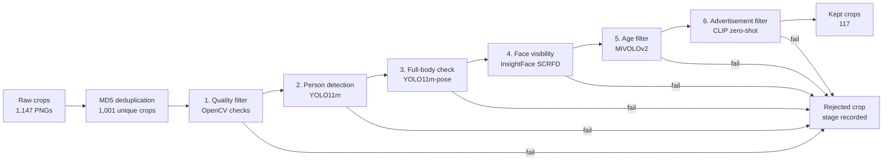

# Person-Crop Dataset Curation Pipeline Report

## 1. Goal

The assignment asks for an automatic curation system for a noisy person-crop
dataset. The final dataset should contain only:

- full-body person crops,
- crops where the face is visible from the front or side,
- real people rather than advertisements or mannequins,
- teenagers or adults, not young children.

The solution also needs to achieve more than 90% dataset requirement coverage,
run efficiently, minimize manual labeling and tuning, and avoid Vision-Language
Models such as GPT, Gemini, InternVL, or Qwen-VL.

This project implements a working end-to-end filtering pipeline and evaluates it
against manually labeled validation data.

## 2. Pipeline Overview

The system is a six-stage early-exit cascade. Each image is checked stage by
stage. If a stage rejects the image, later stages are skipped and the rejection
reason is recorded.

| Step | Stage | Purpose | Method |
| ---: | --- | --- | --- |
| 0 | Deduplication | Remove exact duplicate files before inference | MD5 hash |
| 1 | Quality | Remove very small, dark, blank, or blurry crops | OpenCV heuristics |
| 2 | Person detection | Confirm a person is present | YOLO11m |
| 3 | Full-body check | Confirm head, torso, hips, and knees are visible | YOLO11m-pose |
| 4 | Face visibility | Confirm a detectable visible face | InsightFace SCRFD |
| 5 | Age filter | Exclude likely young children | MiVOLOv2 |
| 6 | Ad filter | Exclude ads, mannequins, and product-style images | CLIP zero-shot prompts |

This design is efficient because cheap filters run first and expensive models
only run on crops that survive earlier checks. It is also easy to audit because
each rejected crop has one recorded `rejected_at_stage` value.



The final submission run processed 1,001 unique crops and kept 117 crops.

## 3. Stage Roles

Each stage answers one simple question. If the answer is "no", the image is
filtered out immediately and the next stages do not run.

| Stage | Role in the pipeline | How it filters images | Why this model or method fits |
| --- | --- | --- | --- |
| Quality | Cheap first-pass cleanup | Rejects crops that are too small, not tall enough for a person crop, too dark, too bright, or blurry. | OpenCV is fast and deterministic, so it removes obvious bad inputs before any GPU model is used. A deep model would be unnecessary for these basic checks. |
| Person detection | Confirms the crop actually contains a person | YOLO11m detects COCO `person` class. The crop is rejected if no confident person is found, if the detected person is too small in the crop, or if there are too many person detections. | YOLO is a strong general-purpose detector and is much more reliable than hand-written shape/color rules for finding people across backgrounds. YOLO11m gives a good accuracy/speed balance for this dataset. |
| Full-body check | Verifies the assignment's full-body requirement | YOLO11m-pose estimates body keypoints. The crop must show at least one head keypoint, both shoulders, both hips, and both knees at sufficient confidence. | Pose keypoints match the requirement directly. This is better than using only bounding-box aspect ratio, because a tall box can still miss legs and a sitting/leaning person can have an unusual box shape. |
| Face visibility | Ensures the face is visible | InsightFace SCRFD detects faces inside the detected person box. The crop is rejected if no face is found, the face is too small, confidence is low, or landmarks are inconsistent. | SCRFD is built specifically for face detection, so it is more suitable here than a generic object detector. It gives confidence, face size, and landmarks that help reject hidden or unreliable faces. |
| Age filter | Removes likely young children | MiVOLOv2 receives both the face crop and body crop, predicts age, and rejects images with predicted age below 16. | Age is not available from YOLO or SCRFD. MiVOLOv2 is designed for visual age estimation and can use both face and body context, which is important when faces are small or side-facing. |
| Advertisement filter | Catches ads, mannequins, and product-style imagery that pass earlier checks | CLIP compares the image to "real person" prompts and "advertisement/mannequin" prompts. If the best ad score is higher than the best real-person score, the crop is rejected. | CLIP is useful because it supports zero-shot semantic filtering. This avoids training a custom ad classifier and keeps manual labeling low, which matches the assignment constraints. |

The stages are ordered from cheap and general to expensive and specific. For
example, the age model only runs after the crop has already passed quality,
person, pose, and face checks. This saves compute and makes every rejection easy
to explain.

## 4. Key Design Decisions

**Early-exit cascade.** A cascade is better than scoring every crop with every
model because many bad crops can be removed cheaply. For example, low-quality
images do not need pose, age, or CLIP inference.

**Pose keypoints for full-body detection.** Bounding-box shape is not reliable:
a sitting person, leaning person, or cropped portrait can all confuse aspect
ratio rules. Keypoints directly test whether important body regions are visible.

**CLIP for ad detection.** The assignment allows deep CV models but asks to
minimize labeling. A trained advertisement classifier would need many labeled
examples, while CLIP can use prompt banks for "real person" vs "advertisement /
mannequin" without training a new classifier.

**No VLMs.** The pipeline uses object detection, pose estimation, face
detection, age estimation, OpenCV checks, and CLIP. It does not use GPT-4V,
Gemini, InternVL, Qwen-VL, or similar VLMs.

**Typed configuration.** Paths, model names, and thresholds are stored in YAML
and validated with pydantic. This keeps tuning explicit and makes each run
reproducible through saved config snapshots.

## 5. Evaluation Setup

The final evaluation uses run `2026-05-12_204240`.

| Item | Value |
| --- | ---: |
| Unique pipeline decisions | 1,001 |
| Labeled validation crops | 207 |
| Labels without decisions | 0 |
| Kept crops in full run | 117 |

The main target metric is **coverage**, which means recall on the reject class:
of the crops that should be rejected, how many did the pipeline actually reject?

In plain English, coverage asks: **"Did we catch the bad images?"**

Simple example:

| Example validation set | Count |
| --- | ---: |
| Bad crops that should be rejected | 100 |
| Bad crops the pipeline rejects | 95 |
| Bad crops that leak through | 5 |

Coverage would be `95 / 100 = 95%`. The 5 leaked crops are the important
mistakes because they enter the final training dataset even though they do not
meet the requirements.

For this project, the validation set has 183 crops labeled as reject and 24
labeled as keep. The pipeline correctly rejected 177 of the 183 reject crops.

```text
coverage = correctly rejected bad crops / all labeled bad crops
         = 177 / (177 + 6)
         = 96.72%
```

This is different from accuracy. Accuracy counts both good crops kept and bad
crops rejected. Coverage focuses only on whether invalid crops were removed,
which matches the assignment goal better because the final dataset should be
clean.

## 6. Results


| Metric | Value |
| --- | ---: |
| Accuracy | 92.75% |
| Precision keep | 71.43% |
| Recall keep | 62.50% |
| F1 keep | 66.67% |
| **Coverage / reject recall** | **96.72%** |

The pipeline clears the assignment's 90% coverage target. It is intentionally
conservative: it rejects most bad crops, but also loses some valid crops. For a
curation task, this is a reasonable trade-off because a smaller clean dataset is
usually preferable to a larger noisy one.


| Count | Value |
| --- | ---: |
| True positives: correctly kept | 15 |
| False negatives: good crop lost | 9 |
| True negatives: correctly rejected | 177 |
| False positives: bad crop leaked | 6 |

## 7. Coverage by Requirement Violation


| Violation type | Labeled | Rejected | Coverage |
| --- | ---: | ---: | ---: |
| blurry | 26 | 26 | 100.00% |
| advertisement | 40 | 40 | 100.00% |
| no_person | 28 | 28 | 100.00% |
| not_full_body | 49 | 48 | 97.96% |
| face_hidden | 32 | 29 | 90.62% |
| minor | 8 | 6 | 75.00% |

Most violation types meet or exceed 90% coverage. The weakest category is
`minor`, with 6 of 8 labeled examples rejected. This is the main remaining
model-risk area because age estimation is difficult for side profiles,
low-resolution faces, and borderline teenager/adult cases.

## 8. Limitations and Future Work

- **Age filtering needs improvement.** Add a face-quality gate before age
  inference, or ensemble MiVOLOv2 with a second age model for borderline cases.
- **Validation labels are limited.** The 207 labels were enough to validate the
  main target, but the minor class only has 8 examples.
- **Inference is mostly per-crop.** Batching YOLO, SCRFD, age, and CLIP stages
  would improve throughput.
- **Ad filtering could be evaluated more directly.** Many ads are rejected
  before the CLIP stage, so a CLIP-only ablation on ad-labeled crops would give
  a cleaner measure of that stage.

## 9. Reproducibility

To reproduce the final run and evaluation:

```bash
python scripts/run_pipeline.py
python scripts/evaluate.py --run-folder artifacts/runs/2026-05-12_204240
```

Important artifacts:

- `artifacts/runs/2026-05-12_204240/decisions.parquet`
- `artifacts/runs/2026-05-12_204240/evaluation.json`
- `notebooks/07_final_evaluation.ipynb`
- `config/config.yaml`
- `config/thresholds.yaml`
